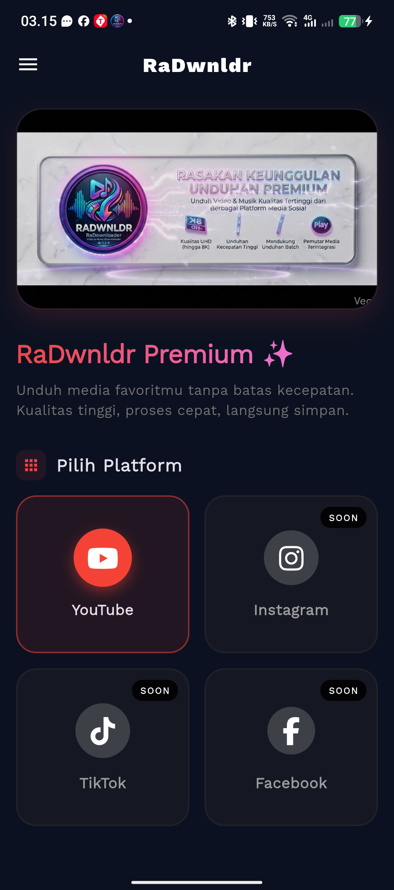
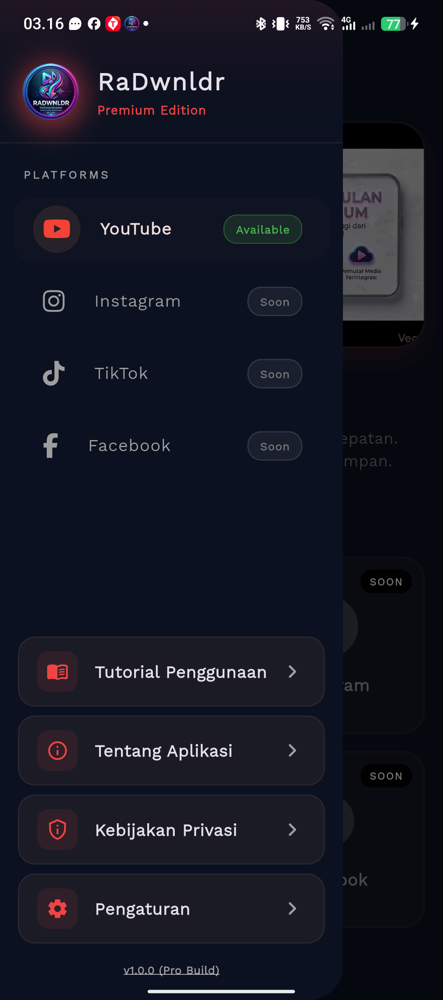
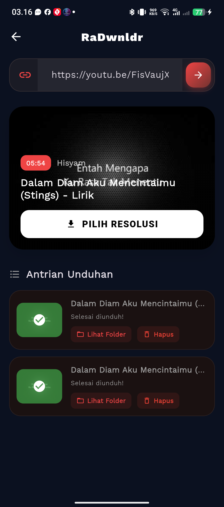
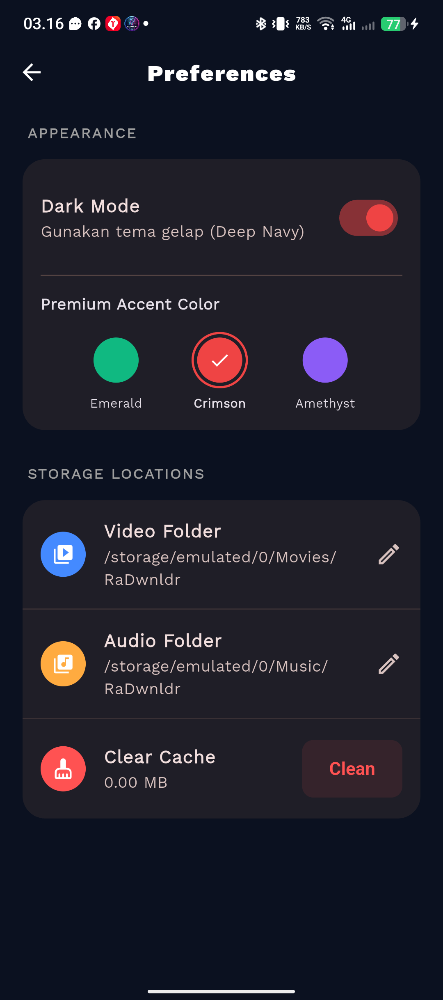

# 📱 RaDwnldr — Premium Media Downloader


**RaDwnldr** adalah aplikasi mobile berbasis Flutter khusus Android untuk mengunduh media dari YouTube (dan platform lainnya dalam waktu dekat). Dirancang dengan UI/UX premium kelas atas (Glassmorphism, animasi sinematik, skeleton loading) serta memiliki sistem unduhan mutakhir (Smart Queue, Anti 403 Forbidden, CPU WakeLock, dan FFmpeg Muxing).

---

## ✨ Fitur Utama

### 🎥 YouTube HD Grabber
- **Real-time Manifest Fetching:** Secara akurat mengambil link unduhan langsung menggunakan spoofing client resmi YouTube (`androidVr`, `safari`, dll) untuk menghindari *Error 403 Forbidden*.
- **Pilihan Resolusi Lengkap:** Dukungan penuh untuk *Video Only* (1080p, 2K, 4K) yang nantinya akan digabung dengan audio, atau resolusi standar (360p, 720p).
- **Pilihan Audio:** Download MP3/Audio murni dengan pilihan *bitrate* (128kbps, 192kbps, 320kbps).

### 🚀 Smart Queue Download Manager
- **Unduh Latar Belakang (Background Download):** Aplikasi menggunakan Native Android `PowerManager.WakeLock` untuk memastikan CPU tidak tertidur saat mengunduh file besar atau melakukan *render*.
- **Notifikasi Pintar:** Integrasi `awesome_notifications` untuk memunculkan notifikasi progress di sistem bar.
- **Auto-Muxing dengan FFmpeg:** Otomatis menggabungkan video HD tanpa suara dengan audio beresolusi tinggi menggunakan `ffmpeg_kit_flutter_new`.
- **Dukungan Format Lengkap:** Pilihan ekspor `.MKV` (Proses Super Cepat - *Copy Codec*) atau `.MP4` (Standar - *Re-Encode* layar mobil/TV).

### 💎 Desain UI Premium & Sinematik
- **Video Banner:** Halaman utama menampilkan banner animasi berbasis video tanpa suara.
- **Glassmorphism & Skeleton Loading:** Memberikan pengalaman visual *High-End* ala aplikasi berlangganan.
- **Dark Mode Support:** Dukungan warna sistem gelap atau terang (Otomatis & Manual).

---

## 🛠️ Tech Stack

| Komponen | Teknologi |
|---|---|
| Framework | Flutter |
| State Management | `provider` |
| Video Fetcher | `youtube_explode_dart` |
| Media Muxer | `ffmpeg_kit_flutter_new` |
| Native Bridge | Android MethodChannel (Kotlin) |
| Notifications | `awesome_notifications` |
| Icons | `font_awesome_flutter` |

---

## 🗂️ Struktur Project

```text
lib/
├── main.dart                          # Entry point & Setup Theme
├── models/
│   ├── download_task.dart             # Model status antrian unduhan
│   └── video_metadata.dart            # Model metadata video YouTube
├── providers/
│   ├── app_provider.dart              # Global State (Theme & Settings)
│   └── queue_provider.dart            # Manajer antrian & logika Smart Queue
├── services/
│   ├── download_service.dart          # FFmpeg, Native WakeLock, Permission
│   └── youtube_service.dart           # Ekstraksi manifest YouTube
├── screens/
│   ├── home_screen.dart               # Dashboard Premium
│   ├── youtube_screen.dart            # Modul Downloader YouTube
│   └── settings_screen.dart           # Pengaturan
└── widgets/                           # Komponen UI Reusable
```

---

## 🚀 Panduan Instalasi & Setup

### Prasyarat
- Flutter SDK sudah terinstall (`^3.24.0` disarankan)
- Android Studio / SDK (Target API 34+)
- **OS Linux / macOS / Windows** untuk kompilasi lokal

### Langkah Instalasi

**1. Clone Repository**
```bash
git clone https://github.com/bangameck/radwnldr.git
cd radwnldr
```

**2. Install Dependencies**
```bash
flutter pub get
```

**3. Jalankan Aplikasi**
```bash
# Mode Development
flutter run

# Build APK Release (Android)
flutter build apk --release
```

---

## 📸 Screenshots

<div align="center">

| Home Screen | Side Menu | YouTube Downloader | Pengaturan |
|:-----------:|:---------:|:-----------------:|:----------:|
|  |  |  |  |

</div>

---

## 📖 Tutorial Penggunaan

### 1️⃣ Salin Tautan (Copy Link)
Buka aplikasi **YouTube resmi**, cari video yang ingin Anda unduh, lalu klik tombol **"Bagikan"** → **"Salin Tautan"**.

### 2️⃣ Tempel Tautan (Paste Link)
Buka **RaDwnldr**, masuk ke menu **YouTube** melalui tombol navigasi. Tempel *(paste)* tautan tersebut ke dalam kolom pencarian di bagian atas layar, lalu tekan **Enter** atau ikon cari.

### 3️⃣ Pilih Resolusi & Format
Aplikasi akan memproses video dan menampilkan daftar resolusi yang tersedia. Pilih sesuai kebutuhan:

| Mode | Pilihan | Keterangan |
|------|---------|------------|
| 🎥 **Video** | 360p, 720p, 1080p, 2K, 4K | HD/4K menggunakan FFmpeg Muxing otomatis |
| 🎵 **Audio** | 128kbps, 192kbps, 320kbps | Download MP3 murni tanpa video |
| 📦 **MKV** | 1080p+ | Proses super cepat (*Copy Codec*) |
| 📱 **MP4** | 1080p+ | Re-encode standar layar mobile |

### 4️⃣ Proses Unduhan & Muxing
Setelah tombol di-klik, file akan masuk ke daftar **"Antrian"**. Untuk video beresolusi tinggi (1080p ke atas), aplikasi otomatis menggunakan teknologi **Muxing FFmpeg** untuk menggabungkan video beresolusi tinggi dengan audio secara *seamless*.

### ⚠️ Peringatan Penting
Selama proses **Muxing** (penggabungan), sangat disarankan untuk **tidak menutup paksa** *(force close)* aplikasi. Aplikasi ini memiliki fitur **WakeLock** yang mencegah HP Anda tertidur selama proses berlangsung — aman diletakkan meskipun layar mati.

### 5️⃣ Buka Hasil Unduhan
Setelah selesai, tekan ikon **folder** pada item di daftar antrian untuk langsung membuka folder penyimpanan:
- 📁 Video disimpan di: `/storage/emulated/0/Movies/RaDwnldr/`
- 🎵 Audio disimpan di: `/storage/emulated/0/Music/RaDwnldr/`

> Lokasi folder dapat diubah kapan saja melalui menu **⚙️ Pengaturan → Storage Locations**.

---

## 👨‍💻 Dikembangkan Oleh


**RadevankaProject**
<br>
[](https://git.io/typing-svg)

- 🧑💻 **Developer:** [@bangameck](https://instagram.com/bangameck)
- 📍 **Lokasi:** Pekanbaru, Riau, Indonesia 🇮🇩

---

## 📄 Lisensi

Hak Cipta &copy; 2026 **RadevankaProject / bangameck**.
Aplikasi ini bersifat berpemilik (Proprietary). Dilarang keras memperjualbelikan atau mengomersialkan ulang tanpa izin resmi. Lihat [LICENSE.md](LICENSE.md) untuk detail lengkap.
